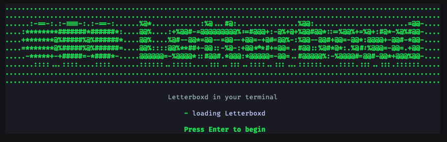
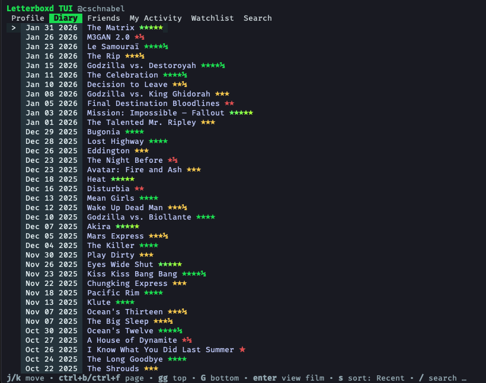
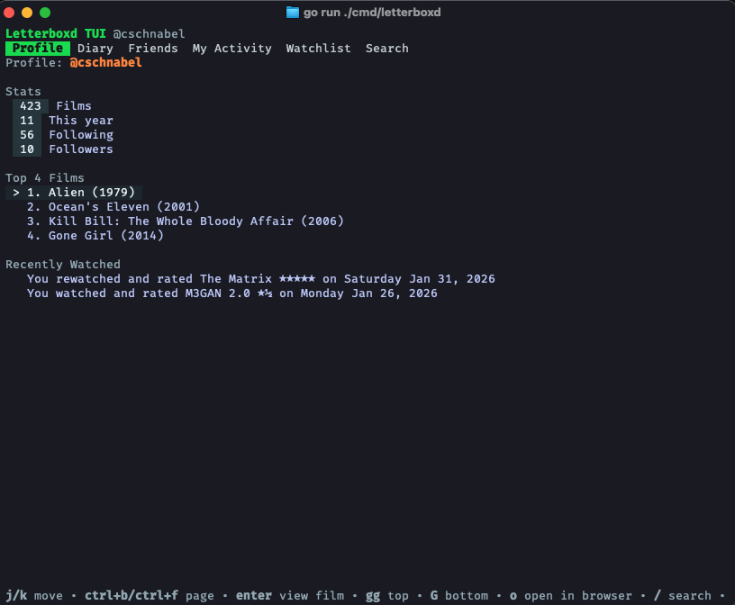
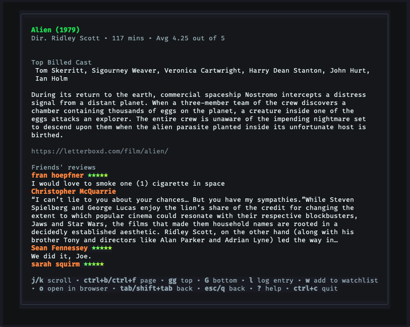

# Letterboxd TUI

Letterboxd in your terminal. Browse profiles, diary entries, watchlists, activity, and film pages with fast keyboard navigation and optional write access via your Letterboxd cookie.

## Screenshots

Onboarding splash



Profile overview



Diary list with ratings and flags



Film detail view with cast, synopsis, and reviews



## Features

- Profile view with stats, top 4 films, and recently watched items.
- Diary browsing with ratings, rewatch/review flags, infinite scrolling, and sorting.
- Watchlist browsing with sorting and quick navigation to film details.
- Film detail view with director, runtime, average rating, cast, synopsis, URL, and your status.
- Friends and activity feeds (friends feed requires a cookie).
- Search with an inline query editor and selectable results.
- Friends' reviews and popular reviews inside film detail pages.
- Add or remove films from your watchlist (requires a cookie).
- Log diary entries with rating, date, rewatch, review text, spoilers, liked, tags, privacy, and draft (requires a cookie).
- Open the selected film or profile in your browser.
- Full keyboard control with built-in help and Vim-style navigation.

## Requirements

- Go 1.24 or newer.
- A real TTY terminal (the app will refuse to run in non-interactive shells).
- This app is only tested on macOS so far. It may work on Linux/Windows, but those platforms have not been validated yet.

## Download

You have a few options depending on how you want to run the app:

1. Download and install with Go (installs a binary into your Go bin directory).

```bash
go install github.com/solean/letterboxd-tui/cmd/letterboxd@latest
```

2. Download the source and build it yourself.

```bash
git clone https://github.com/solean/letterboxd-tui.git
cd letterboxd-tui
```

3. If there are prebuilt binaries available, grab them from the repository releases page.

## Build

```bash
go build -o letterboxd ./cmd/letterboxd
```

## Run

Run the installed binary:

```bash
letterboxd
```

Or run from source without building:

```bash
go run ./cmd/letterboxd
```

## Install (local dev)

```bash
go install ./cmd/letterboxd
```

If `letterboxd` is not on your PATH, add your Go bin directory (for example, `$(go env GOPATH)/bin`).

## Configuration and authentication

A Letterboxd username is required and is read from the config file created by onboarding.
You can override it for a session with `-user` (useful for spoofing another profile without changing your config).

A Letterboxd cookie is optional but unlocks additional features:

- Friends feed
- Add/remove watchlist items
- Log diary entries

To re-run onboarding (updates the config file):

```bash
letterboxd -setup
```

To ignore a stored cookie for a session:

```bash
letterboxd -no-cookie
```

Config is saved at:

```
<user config dir>/letterboxd-tui/config.json
```

Examples:

- macOS: `~/Library/Application Support/letterboxd-tui/config.json`
- Linux: `~/.config/letterboxd-tui/config.json`

## Finding your Letterboxd cookie

Use this if you want write access (watchlist updates, diary logging) or the friends feed.

1. Sign in at letterboxd.com in your browser.
2. Open Developer Tools.
3. Open the Network tab and refresh the page.
4. Click any request to letterboxd.com and copy the full `Cookie` request header.
5. Paste it into the onboarding prompt.

Your cookie must include at least `com.xk72.webparts.csrf=...`.
If you hit a Cloudflare challenge, you may also need `cf_clearance=...`.

Keep your cookie private. It grants access to your account.

## Usage and key bindings

- `tab` / `shift+tab`: switch tabs
- `j` / `k` or arrow keys: move/scroll
- `ctrl+f` / `ctrl+b`: page down/up
- `gg` / `G`: jump to top/bottom
- `enter`: view selected item
- `o`: open in browser
- `/`: focus search input (Search tab)
- `s`: sort (Diary/Watchlist)
- `l`: log entry (Film view, requires cookie)
- `w` / `u`: add/remove watchlist (Film view, requires cookie)
- `?`: toggle help
- `q` or `ctrl+c`: quit

## Flags and environment variables

Flags:

- `-user <name>`: override the configured Letterboxd username for this run
- `-setup`: run first-time setup
- `-no-cookie`: run without a stored cookie
- `-version`: print version and exit
- `-debug`: include debug errors (stack traces, HTTP details)

Environment variables:

- `LETTERBOXD_DEBUG`: set to `1`, `true`, or `yes` to enable debug output
- `LETTERBOXD_USER_AGENT`: override the HTTP user agent

## Troubleshooting

- The app requires a TTY. If you see "This app requires a TTY; run in a terminal.", open a real terminal and try again.
- If you see a Cloudflare challenge message, refresh your cookie from a browser and paste it when prompted.
